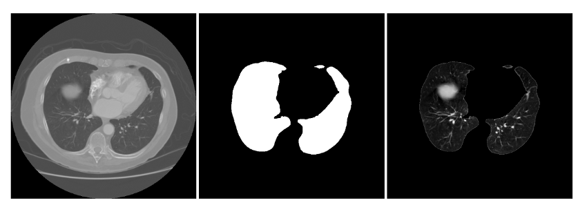
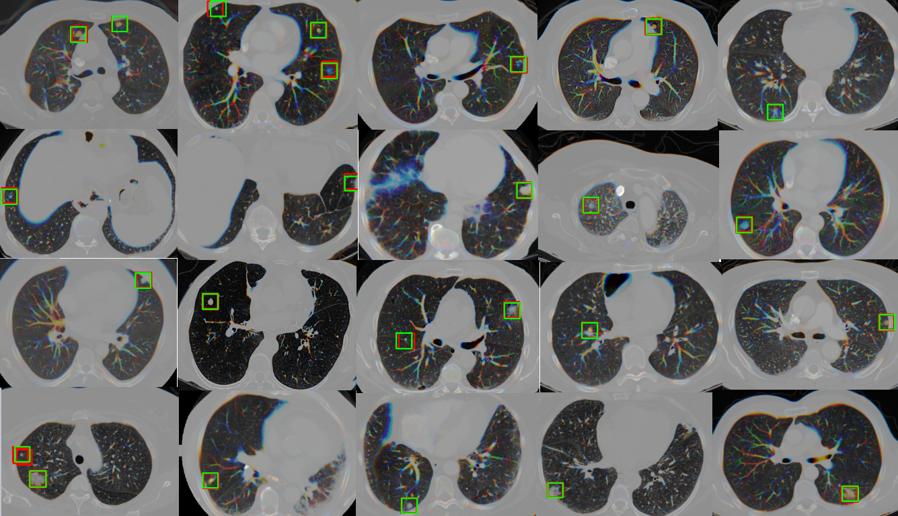
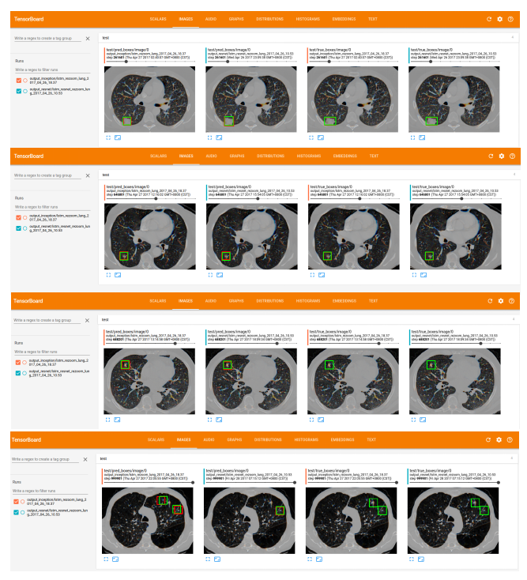
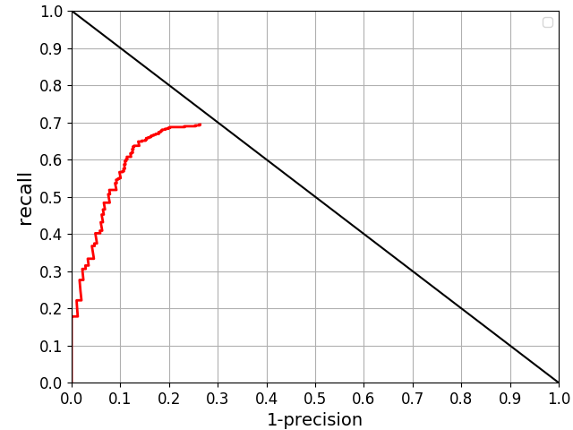

# Introduction

This is a simple framework for training neural networks to detect nodules in CT images. Training requires a json file (e.g. [here](https://github.com/zhwhong/lidc_nodule_detection/blob/master/CNN_LSTM/hypes/lstm_rezoom_lung.json)) containing a list of CT images and the bounding boxes in each image. The network combines both CNN model and LSTM network.

The algorithm here is mainly refered to Paper [***End-to-end people detection in crowded scenes***](https://arxiv.org/abs/1506.04878).
The deep learning framewoek is based on [TensorFlow](https://github.com/tensorflow/tensorflow)(version 1.0.0) and some coding ideas are forked from the [TensorBox](https://github.com/TensorBox/TensorBox) project. Here I show heartfelt gratefulness.
About nodule detection method based on CNN, you can refer to [this paper](https://arxiv.org/abs/1602.03409).

Parsing the lidc XML and dicom files，see [pylung](https://github.com/zhwhong/lidc_nodule_detection/blob/master/pylung) and [blog](http://zhwhong.ml/2017/03/27/LIDC-Dicom-data-and-XML-annotation-parse/).

# Training

First, [install TensorFlow from source or pip](https://www.tensorflow.org/versions/r0.11/get_started/os_setup#pip-installation) (NB: source installs currently break threading on 0.11). Then run the training script `./run.sh`.Note that running on your own dataset should require modifying the `hypes/\*.json` file.

# Evaluation

There are two options for evaluation, an [ipython notebook](https://github.com/zhwhong/lidc_nodule_detection/blob/master/CNN_LSTM/evaluate.ipynb) and a [python script](https://github.com/zhwhong/lidc_nodule_detection/blob/master/CNN_LSTM/evaluate.py).

# Some Image

# Reference

- [Dataset] [The Lung Image Database Consortium image collection(LIDC-IDRI)](https://wiki.cancerimagingarchive.net/display/Public/LIDC-IDRI)
- [Paper] [***End-to-end people detection in crowded scenes***](https://arxiv.org/abs/1506.04878)
- [Paper] [***Deep Convolutional Neural Networks for Computer-Aided Detection: CNN Architectures, Dataset Characteristics and Transfer Learning***](https://arxiv.org/abs/1602.03409)
- [Paper] [***An overview of classification algorithms for imbalanced datasets***](http://www.ijetae.com/files/Volume2Issue4/IJETAE_0412_07.pdf)
- [Blog] [LIDC-IDRI肺结节公开数据集Dicom和XML标注详解](http://zhwhong.ml/2017/03/27/LIDC-Dicom-data-and-XML-annotation-parse/)
- [Blog] [机器学习之分类性能度量指标 : ROC曲线、AUC值、正确率、召回率](http://zhwhong.ml/2017/04/14/ROC-AUC-Precision-Recall-analysis/)
- [简书] [LIDC-IDRI肺结节Dicom数据集解析与总结](http://www.jianshu.com/p/9c1facf70b01)
- [简书] [LIDC-IDRI肺结节公开数据集Dicom和XML标注详解](http://www.jianshu.com/p/c4e9e18195eb)
- [简书] [医疗CT影像肺结节检测参考项目(附论文)](http://www.jianshu.com/p/14df9c48453a)
- [简书] [如何应用Python处理医学影像学中的DICOM信息](http://www.jianshu.com/p/df64088e9b6b)
- [简书] [CT图像肺结节识别算法调研 — CNN篇](http://www.jianshu.com/p/e7dbad9e48ff)
- [简书] [吕乐：面向医学图像计算的深度学习与卷积神经网络（转）](http://www.jianshu.com/p/d29223ee2cb2)
